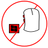

<!-- PROJECT SHIELDS -->
[![Contributors][contributors-shield]][contributors-url]
[![Forks][forks-shield]][forks-url]
[![Stargazers][stars-shield]][stars-url]
[![Issues][issues-shield]][issues-url]
[![MIT License][license-shield]][license-url]
[![LinkedIn][linkedin-shield]][linkedin-url]

<!-- PROJECT LOGO -->
 

  

  <h3 align="center">Inhibit Windows Events</h3>

  

    An awesome README template to jumpstart your projects!
     
     
    <a href="https://github.com/LiamKarlMitchell/InhibitWindowsEvents/issues">Report Bug</a>
    ·
    <a href="https://github.com/LiamKarlMitchell/InhibitWindowsEvents/issues">Request Feature</a>
  

<!-- TABLE OF CONTENTS -->

  
Table of Contents

  <ol>
    <li>
      <a href="#about-the-project">About The Project</a>
      <ul>
        <li><a href="#built-with">Built With</a></li>
      </ul>
    </li>
    <li>
      <a href="#getting-started">Getting Started</a>
      <ul>
        <li><a href="#prerequisites">Prerequisites</a></li>
        <li><a href="#installation">Installation</a></li>
      </ul>
    </li>
    <li><a href="#usage">Usage</a></li>
    <li><a href="#roadmap">Roadmap</a></li>
    <li><a href="#contributing">Contributing</a></li>
    <li><a href="#license">License</a></li>
    <li><a href="#disclaimer">Disclaimer</a></li>
    <li><a href="#contact">Contact</a></li>
    <li><a href="#acknowledgments">Acknowledgments</a></li>
  </ol>

<!-- ABOUT THE PROJECT -->
## About The Project

[![Product Name Screen Shot][product-screenshot]](https://racode.nz/InhibitWindowsEvents)

Prevent Mouse key Back/Forward and Windows Key so you can use them for Push to Talk keys in Discord and other apps.

When switching from Mumble to Discord many years ago I got sick at the mouse buttons not being suppressed.
So I made this utility and released it to some friends.

I checked this behaviour again on 2022/01/08 and saw that Discord still does not have an option to suppress these buttons so thought I would release this utility for others to make use of after seeing many online posts requesting such a feature.

(<a href="#top">back to top</a>)

<!-- BUILT WITH -->
### Built With

* Visual Studio

(<a href="#top">back to top</a>)

<!-- GETTING STARTED -->
## Getting Started

<!-- USAGE EXAMPLES -->
### Usage

Suppressed actions are:
- Mouse extra buttons such as Back and Forward in browser, Mouse 3 Mouse 4 etc.
- Left Windows Key
- ALT + Scroll Lock toggles the hooks so this combination and is also suppressed.

(<a href="#top">back to top</a>)

### Prerequisites

Windows 7 +

(<a href="#top">back to top</a>)

### Installation

Just compile and run or download the release.

(<a href="#top">back to top</a>)

<!-- ROADMAP -->
## Roadmap

- [ ] Add a configuration file for specifying what hooks should be set.

See the [open issues](https://github.com/LiamKarlMitchell/InhibitWindowsEvents/issues) for a full list of proposed features (and known issues).

(<a href="#top">back to top</a>)

<!-- CONTRIBUTING -->
## Contributing

Contributions are what make the open source community such an amazing place to learn, inspire, and create. Any contributions you make are **greatly appreciated**.

If you have a suggestion that would make this better, please fork the repo and create a pull request. You can also simply open an issue with the tag "enhancement".
Don't forget to give the project a star! Thanks again!

1. Fork the Project
2. Create your Feature Branch (`git checkout -b feature/AmazingFeature`)
3. Commit your Changes (`git commit -m 'Add some AmazingFeature'`)
4. Push to the Branch (`git push origin feature/AmazingFeature`)
5. Open a Pull Request

(<a href="#top">back to top</a>)

<!-- LICENSE -->
## License

Distributed under the MIT License. See `LICENSE.txt` for more information.

(<a href="#top">back to top</a>)

<!-- DISCLAIMER -->
## Disclaimer
The code within this repository comes with no guarantee, the use of this code is your responsibility.

I take NO responsibility and/or liability for how you choose to use any of the source code available here. By using any of the files available in this repository, you understand that you are AGREEING TO USE AT YOUR OWN RISK.

(<a href="#top">back to top</a>)

<!-- CONTACT -->
## Contact

Liam Mitchell - liamkarlmitchell@gmail.com

Project Link: [https://github.com/LiamKarlMitchell/InhibitWindowsEvents](https://github.com/LiamKarlMitchell/InhibitWindowsEvents)

(<a href="#top">back to top</a>)

<!-- ACKNOWLEDGMENTS -->
## Acknowledgments

Thanks to the following.
My partner who at one point in time did not have a gaming mouse and wanted Left Windows Key to be PTT.

* [A Simple C Global Low Level Keybaord Hook by StormySpike](https://www.codeproject.com/Articles/19004/A-Simple-C-Global-Low-Level-Keyboard-Hook)
* [Mumble specifically the PTT key suppression feature](https://github.com/mumble-voip/mumble)

(<a href="#top">back to top</a>)

<!-- MARKDOWN LINKS & IMAGES -->
<!-- https://www.markdownguide.org/basic-syntax/#reference-style-links -->
[contributors-shield]: https://img.shields.io/github/contributors/LiamKarlMitchell/InhibitWindowsEvents.svg?style=for-the-badge
[contributors-url]: https://github.com/LiamKarlMitchell/InhibitWindowsEvents/graphs/contributors
[forks-shield]: https://img.shields.io/github/forks/LiamKarlMitchell/InhibitWindowsEvents.svg?style=for-the-badge
[forks-url]: https://github.com/LiamKarlMitchell/InhibitWindowsEvents/network/members
[stars-shield]: https://img.shields.io/github/stars/LiamKarlMitchell/InhibitWindowsEvents.svg?style=for-the-badge
[stars-url]: https://github.com/LiamKarlMitchell/InhibitWindowsEvents/stargazers
[issues-shield]: https://img.shields.io/github/issues/LiamKarlMitchell/InhibitWindowsEvents.svg?style=for-the-badge
[issues-url]: https://github.com/LiamKarlMitchell/InhibitWindowsEvents/issues
[license-shield]: https://img.shields.io/github/license/LiamKarlMitchell/InhibitWindowsEvents.svg?style=for-the-badge
[license-url]: https://github.com/LiamKarlMitchell/InhibitWindowsEvents/blob/master/LICENSE.txt
[linkedin-shield]: https://img.shields.io/badge/-LinkedIn-black.svg?style=for-the-badge&logo=linkedin&colorB=555
[linkedin-url]: https://www.linkedin.com/in/liam-mitchell-84b0053b/
[product-screenshot]: images/screenshot.png